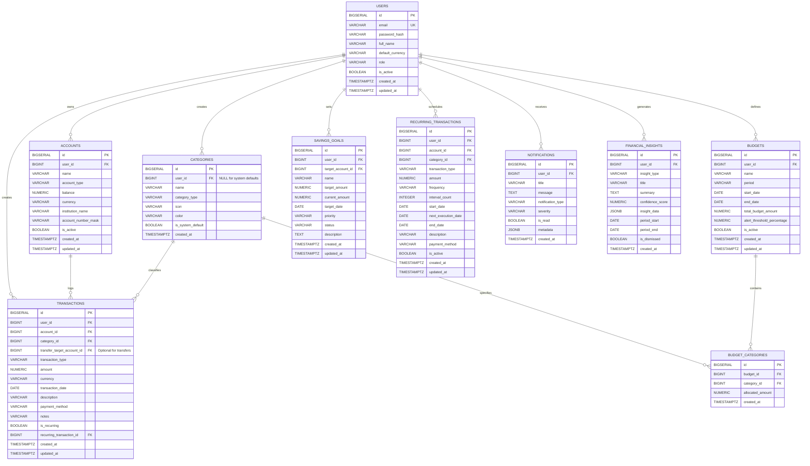

# SmartBudget — Database Design & Schema Specification

**Database Engine:** PostgreSQL 16+  
**Migration Tool:** Flyway  
**Monetary Standard:** `NUMERIC(15, 2)` (Strictly avoids floating-point inaccuracies)  

---

## 1. Entity-Relationship (ER) Diagram

---

## 2. Detailed Table Specifications

### 2.1 `users`
Represents registered application users and credentials.
| Column | Type | Constraints | Description |
|---|---|---|---|
| `id` | `BIGSERIAL` | `PRIMARY KEY` | Unique user identifier |
| `email` | `VARCHAR(255)` | `NOT NULL UNIQUE` | User email for login |
| `password_hash` | `VARCHAR(255)` | `NOT NULL` | BCrypt/Argon2 password hash |
| `full_name` | `VARCHAR(100)` | `NOT NULL` | User full name |
| `default_currency` | `VARCHAR(3)` | `NOT NULL DEFAULT 'INR'` | ISO 4217 currency code |
| `role` | `VARCHAR(20)` | `NOT NULL DEFAULT 'ROLE_USER'` | Access control role |
| `is_active` | `BOOLEAN` | `NOT NULL DEFAULT TRUE` | Soft-disable flag |
| `created_at` | `TIMESTAMPTZ` | `NOT NULL DEFAULT CURRENT_TIMESTAMP` | Account creation timestamp |
| `updated_at` | `TIMESTAMPTZ` | `NOT NULL DEFAULT CURRENT_TIMESTAMP` | Last updated timestamp |

*Indexes:*
- `idx_users_email` on `users(email)`

---

### 2.2 `accounts`
Financial accounts (checking, savings, cash, credit cards, investment).
| Column | Type | Constraints | Description |
|---|---|---|---|
| `id` | `BIGSERIAL` | `PRIMARY KEY` | Unique account identifier |
| `user_id` | `BIGINT` | `NOT NULL REFERENCES users(id) ON DELETE CASCADE` | Account owner |
| `name` | `VARCHAR(100)` | `NOT NULL` | Name (e.g., 'HDFC Salary', 'Cash Wallet') |
| `account_type` | `VARCHAR(30)` | `NOT NULL` | `CHECK (account_type IN ('CHECKING', 'SAVINGS', 'CREDIT_CARD', 'CASH', 'INVESTMENT', 'LOAN'))` |
| `balance` | `NUMERIC(15,2)` | `NOT NULL DEFAULT 0.00` | Current verified balance |
| `currency` | `VARCHAR(3)` | `NOT NULL DEFAULT 'INR'` | ISO currency code |
| `institution_name`| `VARCHAR(100)` | `NULL` | Bank / financial institution |
| `account_number_mask` | `VARCHAR(10)` | `NULL` | Masked identifier (e.g. '••••4912') |
| `is_active` | `BOOLEAN` | `NOT NULL DEFAULT TRUE` | Active status |
| `created_at` | `TIMESTAMPTZ` | `NOT NULL DEFAULT CURRENT_TIMESTAMP` | Creation timestamp |
| `updated_at` | `TIMESTAMPTZ` | `NOT NULL DEFAULT CURRENT_TIMESTAMP` | Last updated timestamp |

*Indexes:*
- `idx_accounts_user_id` on `accounts(user_id)`

---

### 2.3 `categories`
Hierarchical or flat classification for income and expenses.
| Column | Type | Constraints | Description |
|---|---|---|---|
| `id` | `BIGSERIAL` | `PRIMARY KEY` | Unique category identifier |
| `user_id` | `BIGINT` | `NULL REFERENCES users(id) ON DELETE CASCADE` | NULL for system defaults |
| `name` | `VARCHAR(50)` | `NOT NULL` | Category name (e.g., 'Food & Dining') |
| `category_type` | `VARCHAR(20)` | `NOT NULL` | `CHECK (category_type IN ('INCOME', 'EXPENSE', 'TRANSFER'))` |
| `icon` | `VARCHAR(50)` | `DEFAULT 'tag'` | UI icon identifier |
| `color` | `VARCHAR(20)` | `DEFAULT '#6366F1'` | Hex color code for charts |
| `is_system_default`| `BOOLEAN` | `NOT NULL DEFAULT FALSE`| System-provided flag |
| `created_at` | `TIMESTAMPTZ` | `NOT NULL DEFAULT CURRENT_TIMESTAMP` | Creation timestamp |

*Indexes:*
- `idx_categories_user_type` on `categories(user_id, category_type)`

---

### 2.4 `transactions`
The immutable ledger of all financial activities (Income, Expense, Transfer).
| Column | Type | Constraints | Description |
|---|---|---|---|
| `id` | `BIGSERIAL` | `PRIMARY KEY` | Unique transaction ID |
| `user_id` | `BIGINT` | `NOT NULL REFERENCES users(id) ON DELETE CASCADE` | Tenant owner |
| `account_id` | `BIGINT` | `NOT NULL REFERENCES accounts(id) ON DELETE RESTRICT` | Source account |
| `category_id` | `BIGINT` | `NOT NULL REFERENCES categories(id) ON DELETE RESTRICT` | Category |
| `transfer_target_account_id` | `BIGINT` | `NULL REFERENCES accounts(id) ON DELETE RESTRICT` | Target account if TRANSFER |
| `transaction_type` | `VARCHAR(20)` | `NOT NULL` | `CHECK (transaction_type IN ('INCOME', 'EXPENSE', 'TRANSFER'))` |
| `amount` | `NUMERIC(15,2)` | `NOT NULL CHECK (amount > 0)` | Absolute transaction amount |
| `currency` | `VARCHAR(3)` | `NOT NULL DEFAULT 'INR'` | Currency code |
| `transaction_date` | `DATE` | `NOT NULL` | Date of financial event |
| `description` | `VARCHAR(255)` | `NOT NULL` | Brief title |
| `payment_method` | `VARCHAR(30)` | `DEFAULT 'OTHER'` | UPI, DEBIT_CARD, CREDIT_CARD, CASH, NET_BANKING |
| `notes` | `TEXT` | `NULL` | Extended notes/tags |
| `is_recurring` | `BOOLEAN` | `NOT NULL DEFAULT FALSE` | Flag if spawned from recurrence |
| `recurring_transaction_id` | `BIGINT` | `NULL REFERENCES recurring_transactions(id) ON DELETE SET NULL` | Parent rule |
| `created_at` | `TIMESTAMPTZ` | `NOT NULL DEFAULT CURRENT_TIMESTAMP` | Creation timestamp |
| `updated_at` | `TIMESTAMPTZ` | `NOT NULL DEFAULT CURRENT_TIMESTAMP` | Last updated timestamp |

*Indexes:*
- `idx_transactions_user_date` on `transactions(user_id, transaction_date DESC)`
- `idx_transactions_account` on `transactions(account_id)`
- `idx_transactions_category` on `transactions(category_id)`
- `idx_transactions_user_type` on `transactions(user_id, transaction_type)`

---

### 2.5 `budgets`
Budget envelope definition across periods (monthly, weekly, yearly).
| Column | Type | Constraints | Description |
|---|---|---|---|
| `id` | `BIGSERIAL` | `PRIMARY KEY` | Budget ID |
| `user_id` | `BIGINT` | `NOT NULL REFERENCES users(id) ON DELETE CASCADE` | Owner |
| `name` | `VARCHAR(100)` | `NOT NULL` | e.g. 'September 2026 Budget' |
| `period` | `VARCHAR(20)` | `NOT NULL DEFAULT 'MONTHLY'` | `CHECK (period IN ('WEEKLY', 'MONTHLY', 'YEARLY', 'CUSTOM'))` |
| `start_date` | `DATE` | `NOT NULL` | Budget window start |
| `end_date` | `DATE` | `NOT NULL` | Budget window end |
| `total_budget_amount` | `NUMERIC(15,2)` | `NOT NULL CHECK (total_budget_amount > 0)` | Overall budget limit |
| `alert_threshold_percentage`| `NUMERIC(5,2)` | `NOT NULL DEFAULT 80.00` | Threshold to trigger warning (e.g. 80.00%) |
| `is_active` | `BOOLEAN` | `NOT NULL DEFAULT TRUE` | Active state |
| `created_at` | `TIMESTAMPTZ` | `NOT NULL DEFAULT CURRENT_TIMESTAMP` | Creation timestamp |
| `updated_at` | `TIMESTAMPTZ` | `NOT NULL DEFAULT CURRENT_TIMESTAMP` | Last updated timestamp |

*Indexes:*
- `idx_budgets_user_period` on `budgets(user_id, start_date, end_date)`

---

### 2.6 `budget_categories`
Category-specific limits within a parent budget envelope.
| Column | Type | Constraints | Description |
|---|---|---|---|
| `id` | `BIGSERIAL` | `PRIMARY KEY` | Item ID |
| `budget_id` | `BIGINT` | `NOT NULL REFERENCES budgets(id) ON DELETE CASCADE` | Parent budget |
| `category_id` | `BIGINT` | `NOT NULL REFERENCES categories(id) ON DELETE RESTRICT` | Budgeted category |
| `allocated_amount` | `NUMERIC(15,2)` | `NOT NULL CHECK (allocated_amount >= 0)` | Cap for this category |
| `created_at` | `TIMESTAMPTZ` | `NOT NULL DEFAULT CURRENT_TIMESTAMP` | Creation timestamp |

*Constraints & Indexes:*
- `UNIQUE (budget_id, category_id)`
- `idx_budget_categories_budget` on `budget_categories(budget_id)`

---

### 2.7 `savings_goals`
User-defined savings objectives with progress tracking and projected timelines.
| Column | Type | Constraints | Description |
|---|---|---|---|
| `id` | `BIGSERIAL` | `PRIMARY KEY` | Goal ID |
| `user_id` | `BIGINT` | `NOT NULL REFERENCES users(id) ON DELETE CASCADE` | Owner |
| `target_account_id` | `BIGINT` | `NULL REFERENCES accounts(id) ON DELETE SET NULL` | Dedicated account (optional) |
| `name` | `VARCHAR(100)` | `NOT NULL` | e.g. 'Emergency Fund', 'New Laptop' |
| `target_amount` | `NUMERIC(15,2)` | `NOT NULL CHECK (target_amount > 0)` | Target financial sum |
| `current_amount` | `NUMERIC(15,2)` | `NOT NULL DEFAULT 0.00 CHECK (current_amount >= 0)` | Accumulated sum |
| `target_date` | `DATE` | `NOT NULL` | Desired completion date |
| `priority` | `VARCHAR(20)` | `NOT NULL DEFAULT 'MEDIUM'` | `CHECK (priority IN ('LOW', 'MEDIUM', 'HIGH', 'CRITICAL'))` |
| `status` | `VARCHAR(20)` | `NOT NULL DEFAULT 'IN_PROGRESS'` | `CHECK (status IN ('IN_PROGRESS', 'COMPLETED', 'PAUSED', 'CANCELLED'))` |
| `description` | `TEXT` | `NULL` | Goal motivation or details |
| `created_at` | `TIMESTAMPTZ` | `NOT NULL DEFAULT CURRENT_TIMESTAMP` | Creation timestamp |
| `updated_at` | `TIMESTAMPTZ` | `NOT NULL DEFAULT CURRENT_TIMESTAMP` | Last updated timestamp |

*Indexes:*
- `idx_savings_goals_user` on `savings_goals(user_id, status)`

---

### 2.8 `recurring_transactions`
Templates and rules for automatic transaction generation.
| Column | Type | Constraints | Description |
|---|---|---|---|
| `id` | `BIGSERIAL` | `PRIMARY KEY` | Recurrence Rule ID |
| `user_id` | `BIGINT` | `NOT NULL REFERENCES users(id) ON DELETE CASCADE` | Owner |
| `account_id` | `BIGINT` | `NOT NULL REFERENCES accounts(id) ON DELETE RESTRICT` | Source account |
| `category_id` | `BIGINT` | `NOT NULL REFERENCES categories(id) ON DELETE RESTRICT` | Category |
| `transaction_type` | `VARCHAR(20)` | `NOT NULL` | `CHECK (transaction_type IN ('INCOME', 'EXPENSE', 'TRANSFER'))` |
| `amount` | `NUMERIC(15,2)` | `NOT NULL CHECK (amount > 0)` | Amount |
| `frequency` | `VARCHAR(20)` | `NOT NULL` | `CHECK (frequency IN ('DAILY', 'WEEKLY', 'MONTHLY', 'QUARTERLY', 'YEARLY'))` |
| `interval_count` | `INTEGER` | `NOT NULL DEFAULT 1` | Interval multiplier |
| `start_date` | `DATE` | `NOT NULL` | Inception date |
| `next_execution_date`| `DATE` | `NOT NULL` | Next run schedule |
| `end_date` | `DATE` | `NULL` | Termination date (if any) |
| `description` | `VARCHAR(255)` | `NOT NULL` | Description template |
| `payment_method` | `VARCHAR(30)` | `DEFAULT 'AUTO_DEBIT'` | Method |
| `is_active` | `BOOLEAN` | `NOT NULL DEFAULT TRUE` | Status |
| `created_at` | `TIMESTAMPTZ` | `NOT NULL DEFAULT CURRENT_TIMESTAMP` | Creation timestamp |
| `updated_at` | `TIMESTAMPTZ` | `NOT NULL DEFAULT CURRENT_TIMESTAMP` | Last updated timestamp |

*Indexes:*
- `idx_recurring_next_exec` on `recurring_transactions(is_active, next_execution_date)`

---

### 2.9 `notifications`
System and budget alerts (80%, 100%, 120% thresholds, goal milestones, anomalies).
| Column | Type | Constraints | Description |
|---|---|---|---|
| `id` | `BIGSERIAL` | `PRIMARY KEY` | Notification ID |
| `user_id` | `BIGINT` | `NOT NULL REFERENCES users(id) ON DELETE CASCADE` | Recipient |
| `title` | `VARCHAR(150)` | `NOT NULL` | Alert title |
| `message` | `TEXT` | `NOT NULL` | Detailed alert text |
| `notification_type` | `VARCHAR(50)` | `NOT NULL` | `BUDGET_WARNING`, `BUDGET_EXCEEDED`, `ANOMALY_DETECTED`, `GOAL_MILESTONE`, `SYSTEM` |
| `severity` | `VARCHAR(20)` | `NOT NULL DEFAULT 'INFO'` | `INFO`, `WARNING`, `DANGER`, `SUCCESS` |
| `is_read` | `BOOLEAN` | `NOT NULL DEFAULT FALSE` | Read status |
| `metadata` | `JSONB` | `NULL` | Structured data payload (e.g. `{ "budgetId": 12, "pct": 82.5 }`) |
| `created_at` | `TIMESTAMPTZ` | `NOT NULL DEFAULT CURRENT_TIMESTAMP` | Timestamp |

*Indexes:*
- `idx_notifications_user_read` on `notifications(user_id, is_read, created_at DESC)`

---

### 2.10 `financial_insights`
Persisted ML-generated explanations and health evaluations.
| Column | Type | Constraints | Description |
|---|---|---|---|
| `id` | `BIGSERIAL` | `PRIMARY KEY` | Insight ID |
| `user_id` | `BIGINT` | `NOT NULL REFERENCES users(id) ON DELETE CASCADE` | User |
| `insight_type` | `VARCHAR(50)` | `NOT NULL` | `SPENDING_TREND`, `CATEGORY_ANOMALY`, `SAVINGS_HEALTH`, `BUDGET_PACE` |
| `title` | `VARCHAR(150)` | `NOT NULL` | Insight header |
| `summary` | `TEXT` | `NOT NULL` | Explainable human-readable insight |
| `confidence_score` | `NUMERIC(4,2)` | `DEFAULT 0.95` | Model confidence 0.00 to 1.00 |
| `insight_data` | `JSONB` | `NULL` | Underlying ML statistics |
| `period_start` | `DATE` | `NULL` | Analysis window start |
| `period_end` | `DATE` | `NULL` | Analysis window end |
| `is_dismissed` | `BOOLEAN` | `NOT NULL DEFAULT FALSE` | Dismissal flag |
| `created_at` | `TIMESTAMPTZ` | `NOT NULL DEFAULT CURRENT_TIMESTAMP` | Generation timestamp |

*Indexes:*
- `idx_insights_user_created` on `financial_insights(user_id, is_dismissed, created_at DESC)`

---

## 3. Account Balance & Double-Entry Consistency Rules

1. **Transaction Create:**
   - `INCOME`: `accounts[account_id].balance += amount`
   - `EXPENSE`: `accounts[account_id].balance -= amount`
   - `TRANSFER`:
     - `accounts[account_id].balance -= amount` (source)
     - `accounts[transfer_target_account_id].balance += amount` (target)
2. **Transaction Edit / Update:**
   - First reverse original transaction impact on account balance(s).
   - Apply new transaction type/amount to new/original account(s).
3. **Transaction Delete:**
   - Reverse transaction impact:
     - `INCOME`: `accounts[account_id].balance -= amount`
     - `EXPENSE`: `accounts[account_id].balance += amount`
     - `TRANSFER`:
       - `accounts[account_id].balance += amount`
       - `accounts[transfer_target_account_id].balance -= amount`
4. **All operations wrapped in `@Transactional(isolation = Isolation.READ_COMMITTED)` with optimistic locking (`@Version`) on Account entity.**
