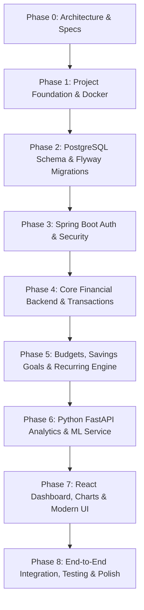

# SmartBudget — Incremental Development Plan & Roadmap

**Target:** Enterprise-Ready, Full-Stack Financial Management Platform  
**Architecture:** React (TypeScript + Vite) + Java 21 (Spring Boot 3) + PostgreSQL + Python 3.12 (FastAPI ML) + Docker  

---

## 1. Development Phases Overview

---

## 2. Phase Breakdown & Deliverables

### Phase 0: System Architecture & Technical Design (Completed)
- [x] Create `ARCHITECTURE.md` (System layers, precision rules, security).
- [x] Create `DATABASE_DESIGN.md` (Mermaid ER diagram, normalized schema, indexes, constraints).
- [x] Create `API_SPECIFICATION.md` (REST endpoints, JWT flow, Python ML contracts).
- [x] Create `DEVELOPMENT_PLAN.md` (Milestone roadmap and criteria).

---

### Phase 1: Project Foundation & Workspace Initialization
- [ ] Initialize repository structure:
  - `backend/` (Maven, Java 21, Spring Boot 3.3+)
  - `frontend/` (Vite, React 19, TypeScript, Tailwind CSS, Lucide icons, Recharts)
  - `analytics/` (Python 3.12+, FastAPI, Uvicorn, Pandas, Scikit-learn)
  - `database/` (Flyway migration SQL files)
  - `docker/` (Dockerfile for each service & `docker-compose.yml`)
- [ ] Setup root environment configuration (`.env.example`, `.gitignore`, `README.md`).
- [ ] Verify local builds (`mvn clean compile`, `npm run build`, `pytest`).

---

### Phase 2: PostgreSQL Database & Migration Setup
- [ ] Create initial Flyway migration `V1__init_schema.sql`:
  - `users`, `accounts`, `categories`, `transactions`, `budgets`, `budget_categories`, `savings_goals`, `recurring_transactions`, `notifications`, `financial_insights`.
- [ ] Create seed data migration `V2__seed_default_categories.sql` for 15+ standard income & expense categories with icons and color tokens.
- [ ] Enforce precision rules (`NUMERIC(15,2)` for all monetary columns).
- [ ] Apply composite indexes for fast date-range and user filtering.

---

### Phase 3: Spring Security & Authentication Engine
- [ ] Configure Spring Security 6 with stateless `SecurityFilterChain`.
- [ ] Implement JWT Token Provider (issuance, signature validation, expiration).
- [ ] Implement `CustomUserDetailsService` and `JwtAuthenticationFilter`.
- [ ] Build `/api/auth` endpoints:
  - Registration with BCrypt password hashing & default account/category bootstrap.
  - Login with JWT access & refresh tokens.
  - Profile retrieval & password change.
- [ ] Unit & integration tests for Auth flow with Mockito & JUnit 5.

---

### Phase 4: Core Financial Backend (Accounts & Transactions)
- [ ] Implement Account domain (Entity, DTOs, Repository, Service, Controller):
  - Checking, Savings, Cash, Credit Card, Investment types.
  - Balance calculations and multi-account net worth summary.
- [ ] Implement Transaction domain (Entity, DTOs, Repository, Service, Controller):
  - Support `INCOME`, `EXPENSE`, `TRANSFER`.
  - Atomically update account balances on create, edit, delete.
  - Handle transfers between accounts without inflating income/expense totals.
  - Pagination, multi-parameter filtering (date range, category, type, min/max amount, keyword search).
- [ ] Comprehensive JUnit/Mockito service tests for double-entry balance correctness.

---

### Phase 5: Budgets, Savings Goals & Recurring Engine
- [ ] Budget domain:
  - Monthly/weekly budget envelopes.
  - Category allocation breakdown.
  - Real-time utilization %, remaining calculations, and 80%/100%/120% threshold alert triggers.
- [ ] Savings Goals domain:
  - Target amount, current amount, target date, priority.
  - Contribution mechanics and monthly required savings pace.
- [ ] Recurring Transactions & Background Scheduling:
  - Spring `@Scheduled` task to process due recurring items daily.
  - Automated generation of transactions and notification alerts.
- [ ] Notifications domain for in-app alert delivery.

---

### Phase 6: Python FastAPI Analytics & ML Service
- [ ] Setup FastAPI microservice structure (`app/main.py`, `app/routes/`, `app/analytics/`, `app/forecasting/`, `app/models/`).
- [ ] Implement Spending Analysis module (Pandas aggregations, category distributions, MoM shifts).
- [ ] Implement Time-Series Expense Forecasting (Moving Average, Linear/Ridge Regression, Confidence Intervals).
- [ ] Implement Anomaly Detection (Z-score standard deviation + Scikit-learn Isolation Forest for unusual transactions).
- [ ] Implement Explainable Financial Health Score (0–100 weighted index).
- [ ] Implement Natural Language Financial Insights generator.
- [ ] Pytest test suite validating all mathematical formulas, forecast models, and edge cases.
- [ ] Integrate Java backend client to call Python service via WebClient.

---

### Phase 7: React Frontend & Modern Fintech UI
- [ ] Design System & Layout:
  - Dark/light mode theme with modern fintech aesthetics, glassmorphism accents, and refined typography.
  - Sidebar navigation, Top Header with notifications bell and profile drawer.
- [ ] Core Pages:
  - `/login` & `/register`: Clean auth screens with real-time field validation.
  - `/dashboard`: Net worth overview, monthly stats, income vs expense charts, category spend donut, budget progress gauge, savings cards, recent activity.
  - `/transactions`: Data table with filters, search, type badges, pagination, and modal for Add/Edit/Transfer.
  - `/budgets`: Budget cards, category progress bars with 80%/100% color-coded indicators, creation wizard.
  - `/accounts`: Account cards with balance history and create account modal.
  - `/goals`: Visual goal progress meters, time-to-goal projections, contribution quick-actions.
  - `/analytics`: Deep-dive charts, AI health score breakdown, expense forecasting graphs, anomaly badges, AI insights feed.
  - `/reports`: Monthly financial statement view with CSV export.
  - `/notifications`: Real-time alert list with read/unread toggle.

---

### Phase 8: Containerization, Testing & Documentation
- [ ] Multi-stage Dockerfiles for backend, frontend, and analytics services.
- [ ] Complete `docker-compose.yml` with health checks, persistent PostgreSQL volumes, and network isolation.
- [ ] Verification of all endpoints, end-to-end user workflows, and error scenarios.
- [ ] Comprehensive `README.md` with architecture diagrams, setup commands, API examples, and portfolio screenshots.

---

## 3. Definition of Done (DoD) Checklist

- [x] Zero floating-point arithmetic on currency values (`NUMERIC(15,2)` & `BigDecimal`).
- [x] Strict tenant isolation (all data scoped by `user_id`).
- [x] Double-entry account balance consistency verified on create, update, delete, and transfers.
- [x] 80%, 100%, 120% budget alert thresholds implemented with automated notifications.
- [x] Python ML service running independently with Pytest coverage for forecasting, anomaly detection, and health scoring.
- [x] Responsive, accessible React UI with Recharts visualizations.
- [x] Docker Compose starts the entire ecosystem cleanly with one command.
