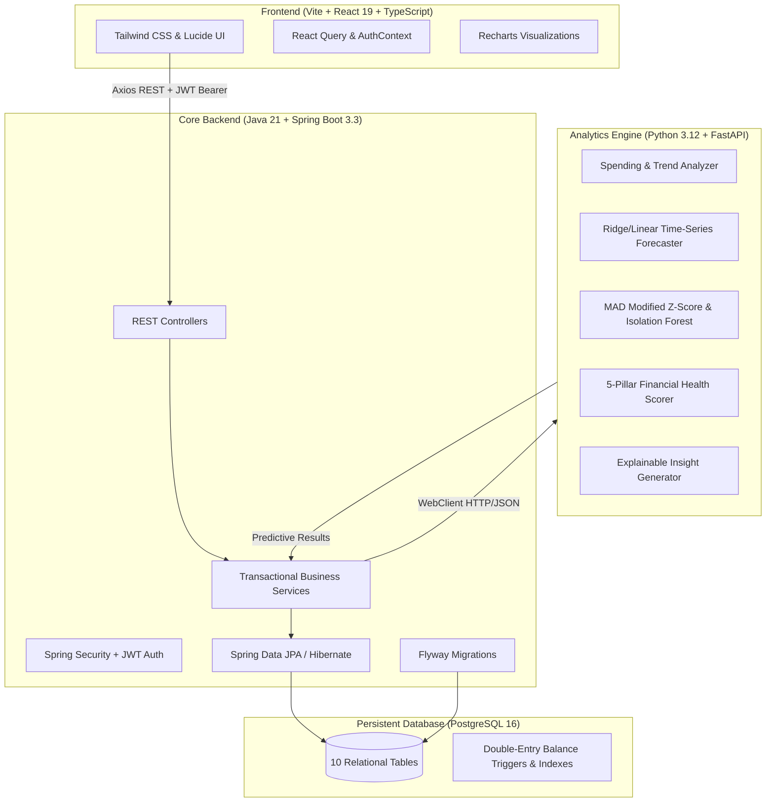

# SmartBudget — Intelligent Personal Finance & Financial Intelligence Platform

SmartBudget is an enterprise-grade, full-stack personal finance and financial intelligence platform designed for individuals and households. It combines transactional accounting with machine learning-powered analytics, predictive expense forecasting, real-time anomaly detection, automated budget tracking with proactive threshold alerts, and an explainable 0–100 Financial Health Score.

---

## Architecture Overview

SmartBudget is built using a modern microservice-ready modular architecture:



---

## Tech Stack Matrix

| Layer | Technologies | Key Libraries & Standards |
| :--- | :--- | :--- |
| **Frontend** | React 19, TypeScript, Vite | Tailwind CSS, Lucide React, Recharts, TanStack Query, Axios, React Router 6 |
| **Core Backend** | Java 21, Spring Boot 3.3 | Spring Security 6, Spring Data JPA, Hibernate, JJWT (0.12), Flyway, Lombok, MapStruct |
| **Analytics Engine** | Python 3.12, FastAPI | Pandas, NumPy, Scikit-learn, Uvicorn, Pydantic v2, Pytest, HTTPX |
| **Database** | PostgreSQL 16 | Strict `NUMERIC(15,2)` precision, B-Tree indexes, Foreign Key cascades |
| **DevOps / Containers** | Docker, Docker Compose | Multi-stage Dockerfiles, Nginx Alpine, Eclipse Temurin 21 JRE, Python Slim |

---

## Core Financial Principles & Invariants

1. **Zero Floating-Point Representation:**
   - All financial amounts are stored as `NUMERIC(15,2)` in PostgreSQL and handled as `BigDecimal` with `RoundingMode.HALF_UP` in Java and 2-decimal rounded floats in Python/Pydantic schemas.
2. **Double-Entry Account Invariant:**
   - Every transaction atomically updates account balances:
     - `INCOME`: Account balance += amount.
     - `EXPENSE`: Account balance -= amount.
     - `TRANSFER`: Source balance -= (amount + fee), Destination balance += amount.
   - Account transfers are excluded from monthly income/expense aggregations to prevent double-counting.
3. **Transaction Immutability on Updates:**
   - Updating or deleting a transaction cleanly reverses the original balance mutation before applying the new state within a `@Transactional` block.
4. **Resilient Analytics Fallbacks:**
   - If the Python Analytics service is temporarily unavailable, the Java backend seamlessly falls back to rule-based mathematical models so user dashboards never crash.

---

## Project Structure

```
c:\Budget_Management\
├── backend/                  # Java 21 Spring Boot Core API
│   ├── src/main/java/com/smartbudget/
│   │   ├── config/           # Security, JWT, WebClient, CORS configs
│   │   ├── controller/       # REST API Controllers (10 endpoints)
│   │   ├── dto/              # Request & Response DTO records
│   │   ├── entity/           # JPA Entities with JPA Auditing
│   │   ├── exception/        # Global Exception Handler & ProblemDetails
│   │   ├── mapper/           # Entity-DTO Mappers
│   │   ├── repository/       # Spring Data JPA Repositories
│   │   ├── security/         # JWT Token Provider & Filter
│   │   └── service/          # Business Services & Analytics Client
│   ├── src/main/resources/
│   │   ├── db/migration/     # Flyway V1 (DDL) and V2 (Seed Data)
│   │   └── application.yml   # Spring configuration
│   ├── src/test/java/        # Comprehensive JUnit 5 & Mockito Unit Tests
│   ├── Dockerfile            # Multi-stage JDK 21 build & JRE runtime
│   └── pom.xml               # Maven configuration
├── analytics/                # Python 3.12 FastAPI Analytics & ML Service
│   ├── app/
│   │   ├── engines/          # Forecaster, Anomaly, Health Scorer, Insights
│   │   ├── models/           # Pydantic Schemas & Data Contracts
│   │   ├── routes/           # FastAPI router endpoints
│   │   └── main.py           # FastAPI Application entry point
│   ├── tests/                # Pytest unit tests
│   ├── Dockerfile            # Python 3.12 slim Docker image
│   └── requirements.txt      # Python dependencies
├── frontend/                 # React 19 + TypeScript + Vite SPA
│   ├── src/
│   │   ├── api/              # Axios REST Client & typed API methods
│   │   ├── components/       # Layouts, Widgets, Modals, Tables, Charts
│   │   ├── context/          # AuthContext with persistent JWT storage
│   │   ├── pages/            # 10 Application Views
│   │   ├── types/            # TypeScript interfaces matching backend DTOs
│   │   ├── App.tsx           # App Routes & Protected Route Guards
│   │   ├── main.tsx          # React 19 Root Render
│   │   └── index.css         # Tailwind & Custom CSS Utilities
│   ├── Dockerfile            # Multi-stage Node.js build & Nginx Alpine runtime
│   ├── nginx.conf            # Nginx SPA fallback & reverse proxy
│   ├── package.json          # Dependencies & npm scripts
│   └── vite.config.ts        # Vite configuration & proxy routes
├── database/
│   └── init-db.sql           # Database bootstrap script
├── docker-compose.yml        # Orchestrated multi-container stack
├── .env.example              # Sample environment variables
└── README.md                 # Project documentation
```

---

## Quickstart with Docker Compose

To launch the complete SmartBudget platform (Database, Java Backend, Python Analytics, React Frontend) in one command:

### 1. Configure Environment
```bash
cp .env.example .env
```

### 2. Build and Start All Services
```bash
docker compose up --build -d
```

### 3. Verify Service Health
- **React Frontend:** [http://localhost:3000](http://localhost:3000)
- **Spring Boot Backend API:** [http://localhost:8080/api/v1](http://localhost:8080/api/v1)
- **Spring Boot Health Actuator:** [http://localhost:8080/actuator/health](http://localhost:8080/actuator/health)
- **Python Analytics Docs (Swagger):** [http://localhost:8000/docs](http://localhost:8000/docs)
- **PostgreSQL Database:** `localhost:5432` (`smartbudget_db`)

---

## Manual Local Development Setup

### 1. PostgreSQL Database
Ensure PostgreSQL is running locally on port 5432:
```sql
CREATE DATABASE smartbudget_db;
CREATE USER smartbudget WITH ENCRYPTED PASSWORD 'smartbudget_secret_2026';
GRANT ALL PRIVILEGES ON DATABASE smartbudget_db TO smartbudget;
```

### 2. Python FastAPI Analytics Service (Port 8001)
```powershell
# In PowerShell:
.\run-analytics.ps1

# Or manually:
cd analytics
& "C:\Users\M S I\AppData\Local\Python\bin\python.exe" -m uvicorn app.main:app --host 0.0.0.0 --port 8001 --reload
```

Run analytics unit tests:
```powershell
cd analytics
& "C:\Users\M S I\AppData\Local\Python\bin\python.exe" -m pytest tests/ -v
```

### 3. Java 21 Spring Boot Backend (Port 8080)
Use the included Maven wrapper which automatically binds to your installed JDK:
```powershell
# In PowerShell:
.\run-backend.ps1

# Or via wrapper:
.\mvnw.cmd spring-boot:run
```

Run backend unit tests:
```powershell
.\mvnw.cmd test
```

### 4. React 19 Frontend (Port 5173 / 3000)
```powershell
# In PowerShell:
.\run-frontend.ps1

# Or manually:
cd frontend
npm install
npm run dev
```
Navigate to [http://localhost:5173](http://localhost:5173) in your browser.

---

## API Quick Reference

### Authentication (`/api/v1/auth`)
- `POST /register` — Register a new user account with default seed categories.
- `POST /login` — Authenticate and receive a JWT access token.
- `GET /me` — Fetch current user profile.

### Accounts & Net Worth (`/api/v1/accounts`)
- `GET /` — List all user accounts with calculated balances.
- `POST /` — Create checking, savings, credit card, investment, or cash account.
- `GET /{id}` — Fetch account details.
- `PUT /{id}` — Update account metadata or balance.
- `DELETE /{id}` — Soft-delete / deactivate account.

### Transactions (`/api/v1/transactions`)
- `GET /` — Filtered & paginated transactions (`startDate`, `endDate`, `categoryId`, `accountId`, `type`, `search`).
- `POST /` — Create income, expense, or transfer with atomic balance mutations.
- `PUT /{id}` — Update transaction details with balance compensation.
- `DELETE /{id}` — Delete transaction and reverse balance.

### Budgets (`/api/v1/budgets`)
- `GET /current` — Fetch active budget with real-time category spending vs limits.
- `POST /` — Create monthly/weekly budget with category allocations.
- `GET /history` — Historical budget adherence and variance analysis.

### Analytics & AI (`/api/v1/analytics`)
- `GET /dashboard` — Complete dashboard aggregated view with health score and insights.
- `GET /forecast` — 30/60/90-day predictive expense forecast with confidence intervals.
- `GET /anomalies` — Machine learning outlier detection on recent expenditures.
- `GET /health-score` — 5-pillar 0-100 Financial Health Score breakdown.
- `GET /insights` — Rule-based and ML-generated proactive recommendations.

---

## Machine Learning & Intelligence Models

1. **Expense Forecaster (`ExpenseForecaster`):**
   - Applies Ridge regularized time-series regression with day-of-week, day-of-month, and rolling momentum features.
   - Calculates dynamic standard-error based confidence intervals (upper/lower bounds).
2. **Anomaly Detector (`AnomalyDetector`):**
   - Combines Modified Z-Scores using Median Absolute Deviation (MAD) for small sample robustness with Isolation Forest for multi-feature spending anomaly detection.
   - Flags suspicious transactions with human-readable explanation tags (e.g., `3.8x higher than category average`).
3. **5-Pillar Financial Health Scorer (`FinancialHealthScorer`):**
   - **Savings Rate (25 pts):** Savings / Gross Income ratio ($>20\%$ for max score).
   - **Budget Adherence (25 pts):** Actual Spending vs Budgeted Limits.
   - **Debt-to-Income / Credit Utilization (20 pts):** Debt obligations relative to total assets.
   - **Emergency Fund Coverage (15 pts):** Liquid savings divided by monthly burn rate (Target: 3–6 months).
   - **Cash Flow Consistency (15 pts):** Net positive monthly cash flow frequency.
   - Produces 0–100 score categorized into: *Critical (0-39), Poor (40-59), Fair (60-74), Good (75-89), Excellent (90-100)*.

---

## License
MIT License. Built for enterprise and personal financial intelligence.
